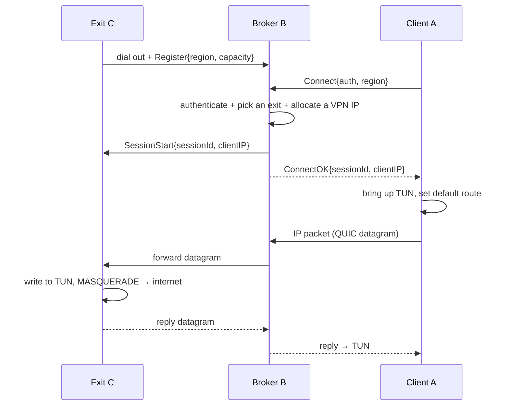

# Architecture

> For basic usage, build commands, and quickstart see [README.md](README.md).
> For full usage guides, config files, platform‑specific setup, and all examples see [USAGE.md](USAGE.md).

---

## Which network layer is this?

A real "all‑protocols" VPN is **Layer 3** — a virtual network card (a **TUN** device) captures raw IP
packets. Revquic carries those IP packets inside **Layer 4 QUIC** between A, B and C. So:

| Plane | Layer | What it is |
|---|---|---|
| What your apps see | **L3 (IP)** | a `tun0` interface; default route points into the tunnel |
| How packets travel | **L4 (QUIC/UDP)** | IP packets ride **QUIC DATAGRAM** frames ([RFC 9221](https://www.rfc-editor.org/rfc/rfc9221)) |
| Auth / signalling | **L7** | QUIC control stream (JSON messages), OIDC, admin REST/SSE |

> **Why datagrams, not a stream?** Tunnelling IP over a *reliable, ordered* QUIC stream re‑creates the
> classic "TCP‑over‑TCP meltdown" (the inner and outer retransmissions fight, one loss stalls everything).
> Revquic therefore carries IP packets in **unreliable QUIC datagrams**, like WireGuard uses UDP — only the
> control/signalling uses reliable streams.

---

## Components & tools

### Binaries (`cmd/`)

| Binary | Role | Responsibility |
|---|---|---|
| **`revquic-broker`** | B | Authenticates clients & nodes, keeps the exit registry, **load‑balances** clients across exits, relays ICE signalling, relays QUIC datagrams (fallback), mints TURN credentials, tracks **QoS + history**, serves the admin API + dashboard. |
| **`revquic-exit`** | C | Dials out to the broker, brings up a TUN device, NATs traffic to the internet, enforces per‑session isolation, optionally upgrades sessions to a direct path. |
| **`revquic-client`** | A | Authenticates to the broker, brings up a TUN device, sets the default route, pumps IP packets over the tunnel; optionally negotiates a direct path. |
| **`revquic-certgen`** | tooling | Generates a CA + broker/node/client certificates for mTLS. |

### Key internal packages (`internal/`)

| Package | What it does |
|---|---|
| `proto` | Control‑plane messages (length‑prefixed JSON) + the datagram codec (8‑byte session id + IP packet). |
| `quicx` | QUIC config (datagrams on) + TLS: self‑signed, **mTLS**, and no‑SNI mTLS for the dynamic direct path. |
| `tunnel` | TUN device wrapper (`songgao/water`) + the TUN⇄datagram pumps. |
| `netcfg` | Linux `ip`/`iptables`, macOS `ifconfig`/`route`, Windows `netsh`/WinNAT helpers: addresses, routes, `MASQUERADE`, and **per‑session isolation** rules. |
| `ippool` | Per‑session VPN address allocation **with reclamation**. |
| `ratelimit` | Token‑bucket **per‑session bandwidth limiter**. |
| `directpath` | NAT‑type → direct/relay **decision policy** + the relay↔direct **migration state machine**. |
| `lb` | **Exit load‑balancing** selection: least‑connections (default), round‑robin, random. |
| `qos` | **Quality‑of‑service tracker**: per‑exit load, per‑session live stats, speed‑drop detection, event **history** ring with optional **SQLite/file persistence**. |
| `telemetry` | Endpoint **QoS reporter**: client/exit send periodic per‑session `MsgReport` to the broker. |
| `ice` | ICE agent seam + a `pion/ice` adapter (gather, trickle, dial/accept, selected‑pair). |
| `directlink` | Establishes a QUIC‑datagram connection **over the ICE‑nominated path**. |
| `icewire` | Drives the ICE negotiation over the broker's signalling relay. |
| `session` | Binds the migration state machine to a swappable datagram path (relay ↔ direct) + rate limit. |
| `oidc` | Verifies **OIDC ID tokens** (RS256 + JWKS, issuer/audience/expiry). |
| `pki` | Tiny CA: generate CA + issue ECDSA leaf certs (used by `revquic-certgen`). |
| `pwhash` | **PBKDF2‑HMAC‑SHA256** admin password hashing. |
| `turncred` | **coturn REST** credential minting (HMAC‑SHA1, short‑lived). |
| `userstore` / `adminstore` | User & admin records behind an interface: **in‑memory**, **JSON file**, or **SQLite**. |
| `auth` / `events` / `adminserver` | Admin token/session auth, an event bus, and the admin HTTP API + embedded SPA. |
| `sysstat` | Host CPU/RAM/disk sampler (Linux /proc + statfs; stub on other platforms). |
| `conf` | Key=value config‑file loader (CLI flags take precedence). |
| `logx` | Log setup: text/json format, optional file output. |
| `shutdown` | Double‑press Ctrl‑C/Ctrl‑Z interactive exit; SIGTERM immediate. |

---

## How a connection works

### Relay path (always available)



### Direct (P2P) upgrade

```mermaid
sequenceDiagram
  participant A as Client A
  participant B as Broker B (signalling + STUN/TURN)
  participant C as Exit C
  Note over A,C: traffic is already flowing over the relay
  A->>B: STUN + trickle ICE candidates
  C->>B: STUN + trickle ICE candidates
  B->>A: peer candidates
  B->>C: peer candidates
  A-->>C: connectivity checks (hole punch, or via TURN)
  Note over A,C: a candidate pair is nominated
  A->>C: QUIC over the nominated path; session migrates off the relay
```

---

## Load balancing & quality of service

The broker actively spreads clients across exit nodes and continuously tracks the health of every
session, keeping a rolling history of what happened.

### Load balancing — picking the best exit

When a client asks for a region, the broker chooses among the exits serving that region using a
configurable strategy (`-lb` on the broker):

| Strategy | Behaviour | Use it when |
|---|---|---|
| `least-conn` *(default)* | Pick the exit with the **fewest active clients**; ties broken by the lower load fraction (active ÷ capacity), then node id. | You want even spread across exits, including ones with different capacities. |
| `round-robin` | Cycle through eligible exits in id order. | Exits are roughly identical and you want simple, predictable rotation. |
| `random` | Pick a uniformly random eligible exit. | Many exits; you want cheap statistical spreading. |

An exit is only eligible if it serves the requested region **and has spare capacity** (an exit
advertises its capacity when it registers; `0` means unlimited). If none qualify, the client gets a
clear "no exit available in region X". Each exit's live load is visible in the admin API
(`activeClients`, and `loadPct` on the node view).

#### Auto vs. manual exit selection (client side)

By default the client lets the broker auto‑select an exit with the strategy above. When a region has
**multiple exits**, the client can instead **pin a specific one**:

```bash
revquic-client ... -list-exits           # print the exits serving the region (no root needed), then exit
revquic-client ... -exit exit-uswest-2   # manual: pin this exit (must serve the region + have capacity)
revquic-client ...                       # omit -exit: automatic load-balancing
```

#### Resilience — reconnect & sleep/wake

Once connected, the client runs a **reconnect loop**: if the broker connection drops (network blip, exit
failure, broker restart) it re‑establishes a fresh session automatically, with capped backoff (≤ 15s),
keeping the TUN device and full‑tunnel routes in place across reconnects. A **sleep/wake watchdog**
notices when the host was suspended (a large wall‑clock jump) and proactively drops the stale connection
so a clean session is established on wake. The very first connect attempt with **no exit available** is
fatal (it tells you and exits); drops *after* a successful connect trigger reconnection instead.

The **exit** is resilient the same way: it runs a **reconnect loop** so a broker outage (restart, network
blip) no longer kills it. The TUN device and the iptables NAT/forwarding rules are set up **once** and
persist; on broker loss the exit tears down its stale sessions, retries `dial + register` with capped
backoff (≤ 15s), and resumes serving — clients re‑establish their sessions automatically through the
reconnected broker. It will also retry if the broker is **down at startup** (so the exit can be launched
before the broker).

#### Session resumption (parked sessions)

When a client disconnects, its session is not torn down immediately — it is **parked** so a quick
reconnect resumes the *same* session (same exit + same VPN IP) instead of getting a fresh one. This keeps
the client's egress IP stable across brief drops and preserves the exit's NAT state.

- The **client** generates a random **resume key** once per process and sends it on every `Connect`
  (`ResumeKey`). All reconnect attempts from that process carry the same key.
- On client disconnect, the **broker** parks the session for **`-session-resume-ttl`** (default **1 hour**):
  it keeps the VPN IP reserved and the session keyed by resume key, and tells the exit
  (`MsgSessionSuspend`) to mark the session **suspended** (the exit keeps it, shown as *parked* on its
  status page). It is removed from the active LB/capacity count while parked.
- On reconnect with a matching, unexpired resume key whose **exit is still online** and **same user**, the
  broker **resumes**: it reattaches the new connection to the existing session id + VPN IP and re‑issues
  `MsgSessionStart` to the exit, which reactivates the parked session (idempotent — it keeps the existing
  NAT state and counters rather than creating a duplicate).
- If the resume window elapses with no reconnect, the broker fully ends the session (releases the IP,
  `MsgSessionEnd` to the exit which removes it) — at that point **both broker and exit agree the client is
  gone**. Clients that send no resume key (or `-session-resume-ttl 0`) are torn down immediately on
  disconnect, as before.

From the client's perspective a reconnect is always a fresh `Connect`; the **broker** decides whether to
**resume** the parked session or **create** a new one, and signals the exit accordingly.

**Intentional exit vs. transient drop.** A deliberate client exit (Ctrl‑C / SIGTERM) closes the QUIC
connection with a dedicated application error code (`proto.CloseClientShutdown`). The broker treats that
as *gone for good*: it ends the session immediately (`MsgSessionEnd` → the exit removes it) rather than
parking it — so a client you quit doesn't linger as "parked" on the exit. Only **transient drops, idle
timeouts, and sleep/wake reconnects** (which don't carry that code) are parked for resume.

#### Direct path vs. relay, and `-direct-mode`

The direct (P2P) path is a win only when ICE finds a **true peer‑to‑peer** pair (`host`/`srflx`). Under
**symmetric NAT / CGNAT** the hole‑punch fails and ICE falls back to a **TURN‑relayed** pair — which is
just *another relay hop*, often **slower** than a well‑placed broker relay (and the direct QUIC runs over
an ICE‑wrapped socket whose kernel buffers can't be tuned). This mirrors how relay‑based remote‑desktop
tools (e.g. RustDesk's `hbbs` rendezvous + `hbbr` relay) handle symmetric NAT: detect it and **relay**,
rather than fight it.

- **`-direct-mode any`** *(default)*: upgrade to direct whenever ICE connects, including TURN‑relayed.
- **`-direct-mode p2p-only`**: only migrate to direct on a true peer‑to‑peer pair; if the only option is
  TURN‑relayed, **stay on the broker relay** (avoids trading a fast relay for a slow one).

### Quality of service — what gets measured

Every session is tracked from connect to disconnect. Two sources feed the broker's QoS tracker:

- **The broker itself** meters every datagram it relays, so it always knows per‑session **byte totals
  and throughput** for the relay path — no endpoint cooperation needed.
- **Clients and exits** additionally send a periodic **report** (`-report-interval`, default `5s`) with
  cumulative bytes, current throughput, dropped‑packet counts (rate‑limit drops), and whether the
  session has migrated to the **direct** path.
- **Host utilization.** Exits send their host **CPU / RAM / disk** in a periodic `node_status` message,
  and clients sample their own host **CPU / RAM / disk every 20s** and include it in their report.

From these it derives, per session: throughput (B/s) and peak, bytes up/down, drops, RTT, the current
path (`relay`/`direct`), and a **degraded** flag.

### Speed‑drop detection

The broker watches each session's throughput against the highest rate that session has sustained. When
throughput falls **below 50 % of its peak** (ignoring idle links below a 64 KB/s floor) it records a
**`speed_drop`** event and marks the session degraded; when it climbs back **above 80 % of peak** it
records a **`recovered`** event.

### History & persistence

The broker keeps a capped, in‑memory ring (default **1000 events**, newest‑first) of lifecycle events:
`node_up`, `node_down`, `connect`, `disconnect`, `speed_drop`, `recovered`.

With a durable store (`-store sqlite` or `-store file`) the history is also written to disk, so it
**survives a broker restart**. Writes are buffered on a background goroutine. The path defaults to
`qos.db` / `qos-history.jsonl`, overridable with `-qosdb`.

### Admin API endpoints

| Endpoint | Returns |
|---|---|
| `GET /api/v1/qos/exits` | Per‑exit load + throughput. |
| `GET /api/v1/qos/sessions` | Per‑session live stats (throughput, bytes, drops, RTT, path, `degraded`). |
| `GET /api/v1/qos/history?limit=N` | The most recent N events (default 200), newest first. |

These also flow over the existing `/api/v1/events` SSE stream and the embedded dashboard.

### Live dashboard

The embedded dashboard (`http://<broker>:8080`) shows the fleet in real time:

- **Auto‑refresh timer** (top‑right): pick `Off / 2s / 5s / 10s / 30s`.
- **Devices** lists each exit with its name, region, system, NAT, connections. Detail panel shows CPU / RAM / disk, bandwidth.
- **Live connections** groups sessions under their exit — path, latency, up/down, rate. Client detail shows host, OS, CPU / RAM / disk, TUN, bandwidth.

---

## Security notes

This is a reference implementation. Before any real use:

- The default tokens/pepper/secrets are **dev placeholders** — replace them and enable **mTLS + OIDC**.
- An exit node egresses arbitrary user traffic to the internet — treat it like running a relay: it carries
  **abuse/liability** implications. Per‑session isolation and rate limits are provided.
- TURN credentials are short‑lived REST creds; the static‑secret demo user is for local testing only.
- No third‑party security audit has been performed.

---

## References & credits

Revquic's design borrows ideas from several excellent open‑source projects (studied as references; **not**
vendored into this repo):

| Project | What we learned from it |
|---|---|
| [fatedier/frp](https://github.com/fatedier/frp) | Reverse‑tunnel broker/agent model, control protocol, NAT hole‑punching. |
| [grepplabs/reverse-http](https://github.com/grepplabs/reverse-http) | Agent‑dials‑proxy over QUIC, routing a client to a specific agent. |
| [junkurihara/rust-rpxy](https://github.com/junkurihara/rust-rpxy) | Modern TLS/mTLS termination + HTTP/3 patterns. |
| [liudanking/quic-proxy](https://github.com/liudanking/quic-proxy) | Using QUIC as a transport for a proxy. |
| [root-gg/wsp](https://github.com/root-gg/wsp) | The simplest reverse‑tunnel (over WebSockets) + connection pooling. |

Built on:
- [quic-go/quic-go](https://github.com/quic-go/quic-go) — QUIC (incl. RFC 9221 datagrams).
- [pion/ice](https://github.com/pion/ice) — ICE / STUN / TURN client for NAT traversal.
- [songgao/water](https://github.com/songgao/water) — TUN/TAP devices in Go.
- [coturn/coturn](https://github.com/coturn/coturn) — STUN/TURN server.
- [dexidp/dex](https://github.com/dexidp/dex) — OIDC identity provider.
- [modernc.org/sqlite](https://gitlab.com/cznic/sqlite) — pure‑Go SQLite.
- Vue 3 + Vite for the admin dashboard.
