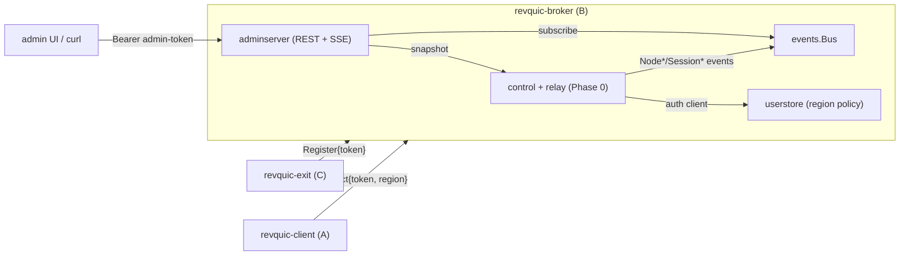

# Revquic Spike — Phase 1 Notes

Phase 1 layers a **control/management plane** on top of the Phase 0 relay data plane, without changing
the data plane itself. See [the spec directory](./) for the full design and
[`api/admin-openapi.yaml`](api/admin-openapi.yaml) for the API contract this implements.

## What Phase 1 adds

| Area | Phase 0 | Phase 1 |
|---|---|---|
| Exit (C) auth | none | **node shared secret** (`-node-token` / exit `-token`), constant-time check |
| Client (A) auth | none | **per-user token** validated against the user store |
| Region policy | none | **per-user `AllowedRegions`** enforced before exit selection |
| Exit selection | first match | region match **+ capacity gating** (`active < capacity`) |
| Admin surface | `GET /api/v1/nodes` (open) | full admin API (users CRUD, regions, nodes, sessions) **behind a bearer token** |
| Real-time | none | in-process **event bus** + **`GET /api/v1/events`** SSE (Snapshot + deltas) |

## Auth model (spike vs production)

The spike uses **static tokens** so the smoke test runs without a PKI:
- `-admin-token` — bearer token for the admin API (and `-admin-user`/`-admin-pass` for `POST /admin/login`).
- `-node-token` — shared secret every exit presents on `Register`.
- client tokens — each user's `credential` in the user store (seed one with `-seed-user token:region`).

**Production upgrade (unchanged design, see spec):**
- Nodes (C) and custom clients (A) authenticate with **mTLS** (broker-issued certs), not shared tokens.
- Users authenticate via **OIDC / short-lived JWTs**; the data-plane QUIC connection gets its own
  per-session identity (spec/reconciliation-and-validation.md §5 gap #1).
- The user store moves from in-memory to **SQLite/Postgres**, credentials hashed (never plaintext).

## Credential & user storage

Users and their region policy are kept behind the `userstore.Store` **interface**, so the backend is
swappable without touching callers:

| Backend | Constructor | Persistence | Use |
|---|---|---|---|
| in-memory | `userstore.New(pepper)` | none (lost on restart) | tests / ephemeral dev |
| **file (JSON)** | `userstore.NewFile(path, pepper)` | atomic write to `path` | the spike default when `-userdb` is set; survives restarts |
| SQLite / Postgres | *(drop-in, not built here)* | durable DB | production / HA — see schema below |

Select at runtime: `revquic-broker -userdb /var/lib/revquic/users.json -cred-pepper <secret>`.

**Admin accounts** are stored separately in `adminstore` (file via `-admindb`, else in-memory) with
**PBKDF2-HMAC-SHA256-hashed passwords** (`internal/pwhash`, per-user random salt, 210k iterations,
constant-time verify; validated against the RFC 7914 known-answer vector). `POST /api/v1/admin/login`
verifies the password and issues a session token consumed by the admin UI.

**Credential hashing.** A user credential is a **high-entropy bearer token** (API-key-like), stored as
`HMAC-SHA256(pepper, token)` — never plaintext. This is a *keyed* hash:
- it allows **O(1) lookup** on auth (hash the presented token, index the map/row), unlike argon2/bcrypt
  whose per-record salt forces an O(n) scan;
- the **pepper** is a server secret (`-cred-pepper`) that must stay **stable** (rotating it invalidates
  all stored hashes, since plaintext is never kept) and **secret** (it gates token verification).
- argon2/bcrypt would be the right choice only for *human passwords* (low entropy); these tokens are not.

The file-persistence test asserts the **plaintext token never appears on disk**, that users survive a
reopen, and that a wrong pepper rejects the token.

> The **node secret** (`-node-token`) is still a process flag in the spike (production: mTLS for nodes).
> **Admin accounts now persist** in `adminstore` with **PBKDF2-hashed passwords** (`internal/pwhash`);
> `POST /admin/login` verifies the password and issues an **8-hour session token**. The admin API accepts
> a valid session token **or** the bootstrap `-admin-token` (CI/smoke convenience). Production would swap
> PBKDF2 for argon2id (a `golang.org/x/crypto` drop-in behind the same `pwhash` interface).

> **OIDC (optional, real user identity):** set the broker's `-oidc-issuer`, `-oidc-audience`, and
> `-oidc-jwks-url` (or `-oidc-jwks-file`). Client `Connect` tokens are then verified as **OIDC ID tokens**
> (`internal/oidc`: RS256 signature against the JWKS + issuer/audience/expiry checks); the token's
> email/subject claim is mapped to a userstore username via `AuthorizeUser` (admin still assigns that
> user's allowed regions). No passwords/long-lived tokens are stored for OIDC users. Local end-to-end
> testing needs a dev IdP (Dex/Keycloak) to issue tokens + serve the JWKS; verification correctness is
> unit-tested offline in `internal/oidc`.

### SQLite/Postgres drop-in (production)
Implement the same `Store` interface over SQL. Suggested schema:
```sql
CREATE TABLE users (
  id              TEXT PRIMARY KEY,
  username        TEXT UNIQUE NOT NULL,
  token_hash      TEXT,                     -- HMAC-SHA256(pepper, token); indexed for auth
  allowed_regions TEXT NOT NULL,            -- JSON array; or a join table users_regions(user_id, region)
  status          TEXT NOT NULL,            -- enabled | disabled
  created_at      TIMESTAMP NOT NULL,
  updated_at      TIMESTAMP NOT NULL
);
CREATE INDEX idx_users_token_hash ON users(token_hash);
```
`AuthenticateForRegion` = `SELECT ... WHERE token_hash = ? AND status='enabled'` then region check. Use a
cgo-free driver (`modernc.org/sqlite`) for portable builds; Postgres for the HA broker fleet. Live exit
nodes and sessions stay in-memory/Redis — they are **not** written to this table.




- `handleExit`: verify `-node-token`; on register/drop publish `NodeConnected` / `NodeDisconnected`.
- `handleClient`: `userstore.AuthenticateForRegion(token, region)` (rejects bad token / disabled user /
  disallowed region); pick a region exit with free capacity; publish `SessionStarted` / `SessionEnded`.
- `adminserver` implements the OpenAPI endpoints; the broker is its `NodeProvider` (live `ListNodes` /
  `ListSessions`); `/events` sends a snapshot then streams bus deltas.

## Try it

```bash
make build
# broker with an admin token, node secret, and a seeded client user for us-west
./bin/revquic-broker -admin-token admin-secret -node-token node-secret -seed-user alice-token:us-west &
# admin API (note the bearer token)
curl -H 'Authorization: Bearer admin-secret' localhost:8080/api/v1/nodes
curl -H 'Authorization: Bearer admin-secret' localhost:8080/api/v1/users
# live feed (SSE): connect, then start an exit/client in another shell and watch events
curl -N -H 'Authorization: Bearer admin-secret' localhost:8080/api/v1/events
```
Full loopback run (Linux + root): `make smoke` (see `scripts/smoke-test.sh`).

## Admin dashboard (embedded)

A dependency-free static dashboard is embedded in the broker via `go:embed`
(`internal/adminserver/web/index.html`) and served at **`/`**. It signs in via `POST /admin/login`,
lists users, and shows a **live Devices table** that updates in real time from the `/api/v1/events`
feed. It consumes SSE via `fetch` + `ReadableStream` (so it can send the `Authorization` header, which
the browser `EventSource` API cannot). Open `http://<B_HOST>:8080/` and sign in with the seeded admin.

> This is the runnable spike UI. The spec's target is a Vue 3 + Vite SPA (frp dashboard pattern), which
> needs an npm toolchain; the vanilla version proves the live event wiring end to end without a build step.

## Verification status (this environment)

- **Built + vetted offline:** `internal/{proto,adminapi,events,userstore,auth,adminserver,pwhash,adminstore}`
  — all compile (`go build`), pass `go vet`, and `gofmt` clean. The embedded dashboard compiles via `go:embed`.
- **`go test -race` passes** (no data races) for `userstore`, `events`, `pwhash`, `adminstore`.
- **Tested:** userstore (region policy, rotation, file round-trip incl. *no plaintext on disk*),
  events (pub/sub), **pwhash (PBKDF2 RFC 7914 known-answer vector + round-trip/tamper)**,
  **adminstore (verify, conflict, no-plaintext-on-disk, persistence round-trip)**.
- **Benchmarked:** `AuthenticateForRegion` ≈ 0.4 µs/op; concurrent auth ≈ 0.2 µs/op.
- **Not compiled here:** the QUIC/TUN packages (`quicx`, `tunnel`) and the three `cmd/*` mains depend on
- **Whole module now builds (with `GOPROXY=direct` + `CGO_ENABLED=0`):** `go build ./...`, `go vet ./...`,
  and `go test ./...` all pass, including the QUIC/TUN packages (`quicx`, `tunnel`) and the `cmd/*` mains —
  the `quic-go` v0.48 datagram API compiled with no drift. A **live control-plane smoke** of a running
  broker passed: admin login (PBKDF2) → session token, user list/create, 401 on bad/no token, SSE
  `Snapshot`, and the dashboard at `/`.
- **Still requires Linux + root:** the full data-plane smoke (`make smoke`) — TUN device + `iptables`
  masquerade live on Linux only (macOS has no `ip`/`iptables` and `netcfg` is Linux-tagged).

## Next (Phase 2)
ICE direct path (`pion/ice`) with relay fallback; replace tokens with mTLS + OIDC; per-session isolation
on C; admin UI SPA consuming `/api/v1/events`.
