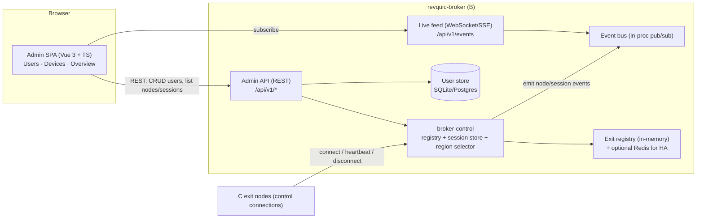
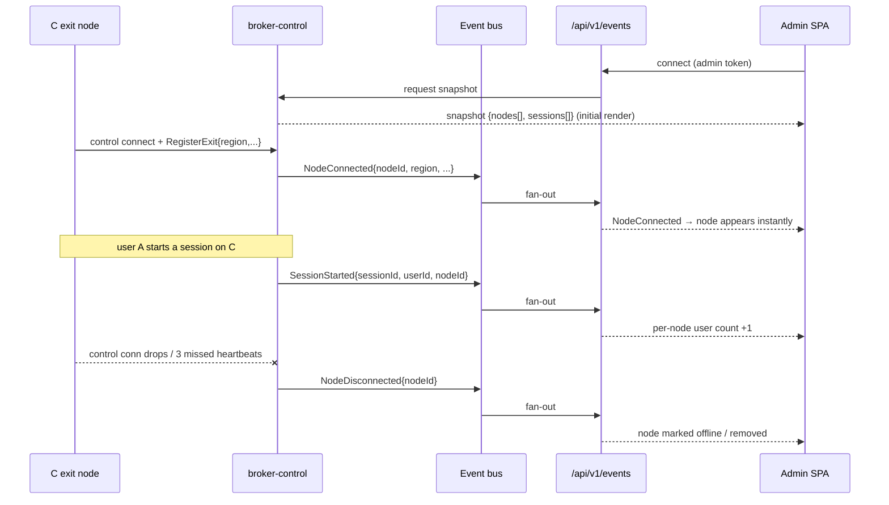
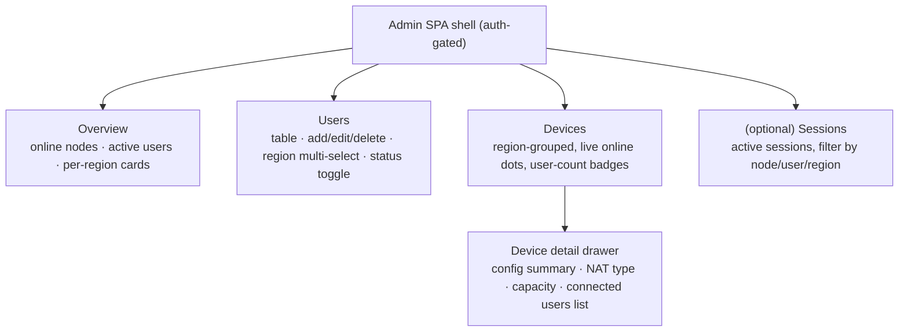

# Revquic — Broker (B) Admin Web UI

> The management plane for the broker. Provides **user management** (CRUD + per-user region assignment)
> and **device management** (live, region-grouped view of connected C exit nodes with details, config, and
> parallel-user counts). Builds on `broker-control` (see [`low-level-design.md`](./low-level-design.md)
> §2.1.2). Reference precedent: `frp`'s embedded Vue dashboards (`frp/web/frps`, `frp/web/frpc`) served via
> `go:embed`.

## 1. Scope

| Feature area | Capabilities |
|---|---|
| **User management** | List/add/edit/delete VPN users; enable/disable; **assign which region(s) each user may connect to**; view a user's current sessions. |
| **Device management (C nodes)** | Region-grouped list of exit nodes; per-node details (ID, region, version, NAT type, public/mapped address, capacity, uptime); basic running config; **live count of users connected in parallel**; admin actions (drain/disable). |
| **Real-time presence** | A C node **appears the moment it connects** and is marked offline the moment it drops — pushed to the browser, no manual refresh. Session counts update live as users connect/disconnect. |
| **Overview dashboard** | Totals: online nodes, active users, sessions, per-region breakdown. |

Out of scope here: VPN data-plane auth (covered in the LLD); billing.

## 2. Architecture

The admin UI is a **single-page app embedded in the `revquic-broker` binary** (frp pattern), talking to an
**admin API** that is part of `broker-control`. It uses **REST for queries/actions** and a **WebSocket
(or SSE) live feed** for real-time node/session events sourced from the broker's in-memory registry.



**Separation of state:**
- **Users persist** in a durable store (SQLite single-broker; Postgres for HA) — they must survive
  restarts.
- **Exit nodes & sessions are live/ephemeral** — they live in `broker-control`'s in-memory registry
  (mirrored to Redis for a multi-broker fleet, like `reverse-http`'s memcached agent store). Presence is
  derived from the live control connection + heartbeats, never from the DB.

## 3. Real-time presence mechanism (the core requirement)

`broker-control` already owns the source of truth: each C holds a persistent control connection and sends
heartbeats (~5s; 3 missed → down). The UI is driven by an **in-process event bus** that `broker-control`
publishes to on every state change; the WebSocket endpoint fans those events out to subscribed browsers.



**Event types (server → UI):**
| Event | Trigger | UI effect |
|---|---|---|
| `Snapshot` | on UI subscribe | initial full state |
| `NodeConnected` | C control connection established + registered | node appears (online) |
| `NodeUpdated` | heartbeat: load/health/capacity/RTT change | refresh node row/metrics |
| `NodeDisconnected` | control conn closed / heartbeat timeout | node → offline / removed |
| `SessionStarted` | user session bound to a node | node user-count +1; sessions list add |
| `SessionEnded` | session torn down | node user-count −1; sessions list remove |

**Transport choice:** **WebSocket** (bidirectional, matches `frp`/`wsp` which already use
`gorilla/websocket`) or **SSE** (simpler, server→client only — sufficient since the UI pushes actions over
REST, not the feed). Recommendation: **SSE for the feed + REST for actions** if you want the simplest
correct design; **WebSocket** if you later need client→server streaming. Either way, send a **snapshot on
connect, then deltas**, and have the client reconcile by `nodeId`/`sessionId`.

## 4. Data models

### User (persisted)
```go
type User struct {
    ID            string     // uuid
    Username      string     // unique
    CredentialRef string     // hash ref or cert fingerprint (never store raw secrets)
    AllowedRegions []string  // [] = none; ["*"] = any; else explicit region codes
    Status        string     // enabled | disabled
    CreatedAt     time.Time
    UpdatedAt     time.Time
    // derived (not stored): ActiveSessions int
}
```
`AllowedRegions` is the field that satisfies *"choose which user connects to which region."* It is
**enforced by the region selector** in `broker-control`: a user's `ConnectRequest{region}` is rejected if
the region is not in `AllowedRegions` (see LLD §2.1.2 update).

### Device view model (derived from the live registry; not persisted)
```go
type DeviceView struct {
    NodeID        string
    Region        string
    Status        string    // online | draining | down
    Version       string
    NATType       string    // full-cone | restricted | port-restricted | symmetric
    PublicAddr    string
    Capacity      int
    ActiveUsers   int       // parallel connected users (live)
    LoadPct       float64
    RTTms         int
    ConnectedAt   time.Time
    LastSeen      time.Time
    Config        DeviceConfigSummary // region, capacity, vpnType, dataplane mode, uplink iface
}
```

## 5. Admin REST API (`/api/v1`)

| Method & path | Purpose |
|---|---|
| `POST /admin/login` | Admin auth → admin session token (separate from VPN user auth). |
| `GET  /users?region=&status=&page=` | List users (paginated, filterable). |
| `POST /users` | Create user `{username, credential, allowedRegions[]}`. |
| `GET  /users/{id}` | User detail + current sessions. |
| `PATCH /users/{id}` | Update `allowedRegions`, `status` (enable/disable), credential. |
| `DELETE /users/{id}` | Delete user (and revoke active sessions). |
| `GET  /regions` | Region list with `{nodeCount, onlineNodes, activeUsers}`. |
| `GET  /nodes?region=&status=` | List exit nodes (live `DeviceView`s), region-filterable. |
| `GET  /nodes/{id}` | Node detail: config summary + connected sessions. |
| `POST /nodes/{id}/drain` | Stop routing new sessions to a node (graceful). |
| `GET  /sessions?nodeId=&userId=&region=` | Active sessions. |
| `GET  /events` | **Live feed** (WebSocket/SSE): `Snapshot` then deltas. |

> These extend the admin endpoints already sketched in LLD §2.1.2 (`/v1/nodes`, `/v1/sessions`,
> `/v1/users`, `/v1/regions`). Deleting/disabling a user must also **revoke live sessions** (emit
> `SessionEnd` to the relevant C).

## 6. Frontend pages



- **Users page:** data table; "Add user" modal (username, credential, **region multi-select**); inline
  enable/disable; delete with confirm. Region multi-select is bound to `AllowedRegions`.
- **Devices page:** nodes grouped by region; each row shows a **live status dot** (green online / grey
  offline), version, NAT type, capacity, and a **parallel-user-count badge** that updates live. Rows
  appear/disappear in real time via the event feed. Click → detail drawer with config + connected users.
- **Overview:** counts + per-region summary cards, all live.

## 7. Technology stack

| Concern | Recommendation | Why / reference |
|---|---|---|
| SPA framework | **Vue 3 + TypeScript + Vite** | Mirrors `frp/web/frps` & `frp/web/frpc`; embeddable. (React is fine if preferred.) |
| Component library | Element Plus / Naive UI (Vue) | what frp's dashboards use. |
| Embedding | **`go:embed`** the built SPA into `revquic-broker` | single-binary deploy, exactly like `frp` `web/*/embed.go`. |
| HTTP router | `gorilla/mux` or `chi` | `frp` uses `gorilla/mux`. |
| Live feed | `gorilla/websocket` **or** SSE (`net/http` flusher) | `frp`/`wsp` use `gorilla/websocket`. |
| User store | **SQLite** (single broker) → **Postgres** (HA) | users must persist; live node/session state stays in-memory/Redis. |
| Live node/session state | in-memory registry, optional **Redis** for broker fleet | `reverse-http` uses memcached for the agent store. |
| Metrics (optional) | Prometheus endpoint feeding the Overview | `frp/server/metrics`. |

## 8. Security

- **Admin plane is separate from the VPN user plane.** Distinct admin accounts with **RBAC** (at least
  `admin` vs `read-only`); do not reuse VPN user credentials.
- **Do not expose the admin UI on the public VPN/QUIC port.** Bind it to a management interface / behind a
  reverse proxy with TLS, or require admin mTLS. (`rust-rpxy` patterns for TLS/mTLS termination apply.)
- All admin actions audit-logged (who changed which user/region, who drained which node).
- Credentials are stored hashed (or as cert fingerprints) — never raw.
- The live feed endpoint requires a valid admin token; scope events to the admin's permitted regions if
  multi-tenant.

## 9. Integration changes to the rest of the spec

1. **Region selector (LLD §2.1.2)** must filter by the connecting user's `AllowedRegions` *before*
   load/RTT sorting, and reject if empty/disallowed.
2. **`broker-control`** publishes `NodeConnected/Updated/Disconnected` and `SessionStarted/Ended` to an
   in-process **event bus**; the admin WebSocket/SSE endpoint subscribes and fans out.
3. **User store** becomes a first-class broker dependency (was implicit in the auth service); the admin API
   is its CRUD front end and the auth service reads from it.

## 10. Build plan (fits the phased plan in the LLD)

| Phase | Admin-UI deliverable |
|---|---|
| **1 (Relay product)** | User store + CRUD REST + region assignment enforced by the selector; minimal Users page; read-only Devices list (polled). |
| **2 (Direct/P2P)** | Real-time event bus + WebSocket/SSE feed; live Devices page with presence + parallel-user counts; Overview dashboard. |
| **3 (Hardening/scale)** | RBAC + audit log; Redis-backed live state for a broker fleet; drain/disable node actions; per-region admin scoping. |
