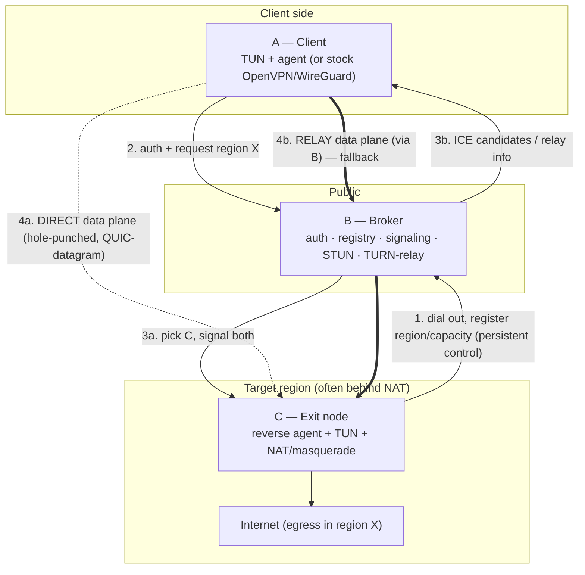
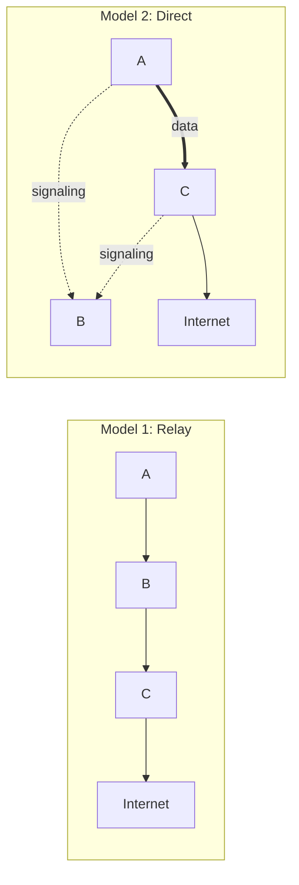
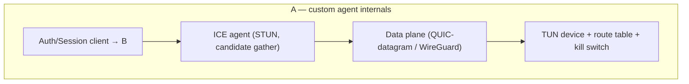
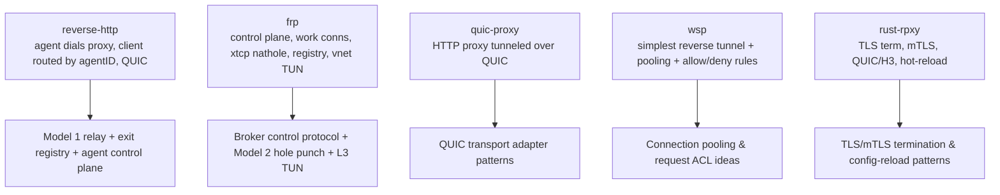

# Revquic — High-Level Design

> What to build, at a system level. Read [`feasibility.md`](./feasibility.md) first for the rationale
> behind the layer choice (L3-over-QUIC-datagram) and the OpenVPN/hole-punch verdicts. Component-level
> step-by-step detail is in [`low-level-design.md`](./low-level-design.md).

> **Chosen direction (refined scope).** The **primary** architecture is the **custom client with a
> pure-QUIC data plane and ICE-based direct path**, with B acting as auth + signaling mediator + STUN/TURN
> (Model 2 below). The data plane carries IP packets as **QUIC datagrams (RFC 9221)** — *not* reliable
> streams (see [`reconciliation-and-validation.md`](./reconciliation-and-validation.md) §3). Stock
> OpenVPN-over-TCP relayed through B is retained only as a **named fallback** for clients that cannot run
> custom software — see [`alternative-strategy-openvpn-quic.md`](./alternative-strategy-openvpn-quic.md).
> Both strategies share B's control plane, C's egress NAT, and the user database.

## 1. System overview

Revquic routes a user's full internet traffic so it egresses from a chosen region through an exit node that
**dialed outward** to a public broker. Three roles:

The novel property is **(1)**: exit nodes initiate the connection, so they can live on residential/NAT'd
networks — the same inversion used by `reverse-http` (agent→proxy), `frp` (frpc→frps), and `wsp`
(client→server), but generalized to a **full L3 VPN with region selection**.

## 2. Two connection models (build in this order)

### Model 1 — Relay (Phase 1; always works; mandatory fallback)
`A → B → C`. B forwards the encapsulated L3 packets between A and C. Works for any NAT, supports a **stock
OpenVPN/WireGuard client** at A (B acts as the VPN server and routes per-user into the QUIC tunnel to C).
B pays the bandwidth.

### Model 2 — Direct / hole-punched (Phase 2; optimization)
`A ⇄ C` directly; B only authenticates and signals (STUN + candidate exchange). Lower latency, cheap for B.
Requires a **custom A-side agent**. Falls back to Model 1 when hole punching fails (symmetric NAT / CGNAT).

## 3. Components / services to build

### B — Broker (public, always-on; keep it thin)
| Service | Responsibility | Reference precedent |
|---|---|---|
| **Auth service** | Validate A (user/pass, cert, or OIDC) and C (node identity/cert). Issue short-lived session tokens. | `reverse-http` JWT (`pkg/jwtutil`); `frp` token/OIDC (`pkg/auth`) |
| **Exit registry** | Track connected C's: region, capacity, health, public/mapped addrs. Select an exit per request. | `reverse-http` agentID→addr store; `frp` `server/registry` |
| **Control server** | Accept persistent outbound control connections from C (and from custom A-agents). Carry signaling messages. | `reverse-http` QUIC agent server; `frp` `server/control.go` + `pkg/msg` |
| **STUN server** | Reflexive address discovery for hole punching. | `frp` uses `pion/stun` |
| **Signaling / session orchestrator** | On A connect: authenticate → pick C → exchange ICE candidates → choose direct-or-relay → tear down on disconnect. | `frp` `pkg/nathole/controller.go` (server-mediated exchange) |
| **TURN-style relay data path** | Forward L3 packets A↔C when direct fails. | `reverse-http` proxy stream relay; ICE/TURN model |
| **(Optional) OpenVPN front** | Terminate stock OpenVPN/WireGuard clients and route per-user into the QUIC tunnel to C. | new; standard OpenVPN server + policy routing |
| **User store + auth source** | Persistent VPN user records: credentials, status, and **per-user allowed regions** (enforced by the region selector). SQLite (single) / Postgres (HA). | new; consumed by auth service + admin UI |
| **Admin web UI + API** | **User management** (CRUD + region assignment) and **real-time device management** (region-grouped C nodes, config, live parallel-user counts, instant connect/disconnect presence). Embedded Vue SPA + REST + WebSocket/SSE live feed. See [`admin-web-ui.md`](./admin-web-ui.md). | `frp` embedded Vue dashboards + `server/metrics`; `gorilla/websocket` |

### C — Exit node / reverse agent (in target region, often NAT'd)
| Service | Responsibility | Reference precedent |
|---|---|---|
| **Dial-out control client** | Connect to B, authenticate, register `{region, capacity}`, keep alive, receive session commands. | `reverse-http` `pkg/agent`; `frp` `client/control.go` |
| **Data-plane endpoint** | Per session, open a QUIC-datagram tunnel — to B (relay) or directly to A (after hole punch). | `reverse-http` agent QUIC streams; QUIC datagrams |
| **STUN client + hole-punch logic** | Discover mapped addr; execute simultaneous-send punch with port prediction. | `frp/pkg/nathole` (`analysis.go`, `classify.go`, `discovery.go`) |
| **L3 egress** | TUN device (or kernel) + `MASQUERADE`/NAT to local uplink; per-session routing/firewall isolation. | `frp/pkg/vnet` (TUN per-OS); standard `iptables` |
| **Abuse controls** | Per-session ACLs, rate limits, destination policy, logging. | new (see Security) |

### A — Client
Two client options sharing the **same broker protocol**:
| Option | What it is | When |
|---|---|---|
| **Stock client** | OpenVPN or WireGuard config pointing at B. | Relay tier; zero custom software. |
| **Custom agent** | Daemon: auth to B → get exit + candidates → hole-punch → bring up TUN → run QUIC-datagram/WireGuard data plane → set default route + kill switch → relay fallback. | Direct tier; best latency. |

## 4. Recommended technology stack

| Concern | Recommendation | Why / reference |
|---|---|---|
| Language (B, C, agent) | **Go** | All four Go references; mature QUIC (`quic-go`), STUN (`pion/stun`), TUN libs; `frp`/`reverse-http` are directly mineable. |
| Control/signaling transport | **QUIC (mutual TLS)** with typed messages | `reverse-http` agent transport; `frp/pkg/msg` message pattern. |
| Data-plane encapsulation | **QUIC DATAGRAM (RFC 9221)** carrying L3 packets; **WireGuard** as an alternative/explicit-roaming option | feasibility §3 — never IP-over-reliable-stream. `quic-go` supports datagrams. |
| L3 device | **TUN** (`songgao/water` as in `frp/pkg/vnet`, or `wireguard-go`/kernel WG) | full-protocol VPN. |
| NAT traversal | **STUN + simultaneous-send hole punch + port prediction**, reuse `frp/pkg/nathole` | proven Go implementation in-repo. |
| Relay fallback | B-hosted **TURN-like** QUIC relay | mandatory per ICE lessons. |
| Auth | **mTLS for nodes**; **OIDC or cert/user-pass for users** | `frp` OIDC, `reverse-http` JWT. |
| Exit registry/store | in-memory + optional **memcached/Redis** for HA broker fleet | `reverse-http` memcached store (`agentID→addr`). |
| Metrics/admin | **Prometheus** + small dashboard | `frp` metrics/dashboards. |
| Config | **TOML** (hot-reloadable for B/C) | `frp` TOML, `rust-rpxy` hot reload. |

> A Rust implementation is viable too (`rust-rpxy` shows a high-quality hyper/rustls/quinn stack with H3
> and PROXY-protocol), but Go gives the most direct reuse of the in-repo NAT/TUN/agent code, so the HLD/LLD
> assume Go.

## 5. How each reference maps onto Revquic

- **`reverse-http` is the closest existing analogue to Model 1.** It already has agents that dial out, a
  client routed to a specific agent by ID, QUIC transport, and an HA store mapping `agentID→address`.
  Revquic ≈ `reverse-http` + region-aware selection + **L3 TUN data plane instead of L4 CONNECT**.
- **`frp` is the closest analogue to Model 2 and to the control plane.** Mine `pkg/nathole` for hole
  punching, `pkg/msg` for the control protocol shape, `server/registry` for the exit registry, and
  `pkg/vnet` for TUN handling.
- **`quic-proxy`** shows the minimal QUIC↔`net.Conn` adapter pattern (useful for the relay path).
- **`wsp`** shows connection pooling and regex allow/deny rules (useful for exit-side ACLs).
- **`rust-rpxy`** shows production TLS/mTLS termination, QUIC/H3, and hot-reloadable config — patterns for
  B's TLS front and config story.

## 6. Security model (design in from day one)

| Area | Requirement |
|---|---|
| Node identity | C and custom-A authenticate with **mTLS**; B pins/issues node certs. |
| User auth | OIDC or cert/user-pass; **short-lived session tokens** for the data plane. |
| Data-plane crypto | QUIC TLS 1.3 (or WireGuard Noise). Per-session keys; no long-lived shared secrets on the wire. |
| Signaling integrity | All candidate/relay info travels over the authenticated control channel (cf. `frp` `NatHoleSid` nonce to bind exchanges). |
| **Exit-node abuse/liability** | C egresses arbitrary user traffic to the internet. Mandatory: per-session destination ACLs, rate limiting, abuse reporting hooks, and a clear logging/retention policy. Treat operating a C as operating an exit relay. |
| Kill switch (A) | If the tunnel drops, the agent must **block default-route traffic** to prevent IP leaks. |
| DNS | Route DNS through the tunnel; prevent local resolver leaks. |
| Tenant isolation on C | Per-session routing tables / namespaces so users cannot see each other or C's LAN. |

## 7. Non-goals / explicit scope cuts (initial version)
- Not a mesh/many-to-many overlay (unlike Tailscale); it is **client → chosen exit**.
- No built-in content filtering/CDN (that is `rust-rpxy`'s domain).
- Symmetric-NAT-both-ends P2P is **not** guaranteed — those sessions relay. That is acceptable and expected.
