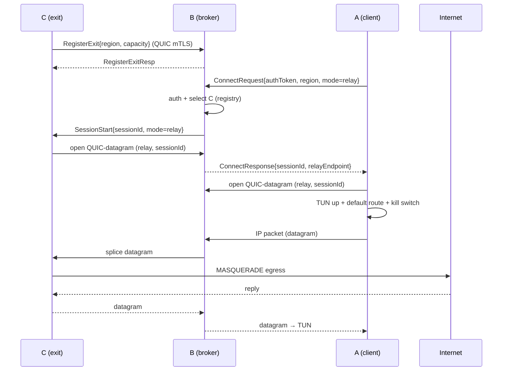
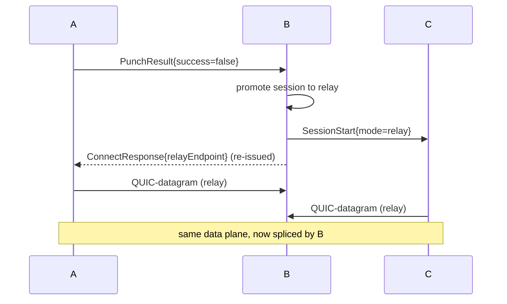

# Revquic — Low-Level Design

> Component-level, step-by-step detail. Assumes the decisions in [`feasibility.md`](./feasibility.md) and
> the system shape in [`high-level-design.md`](./high-level-design.md). Language: Go (for maximum reuse of
> the in-repo references). Message names are illustrative; model them on `frp/pkg/msg`.

## 1. Process / module inventory

| Binary | Role | Key internal modules |
|---|---|---|
| `revquic-broker` (B) | public broker | `auth`, `registry`, `control` (QUIC server), `stun`, `orchestrator`, `relay`, `metrics`, optional `ovpn-front` |
| `revquic-exit` (C) | exit node | `control-client`, `holepunch` (STUN+punch), `dataplane` (QUIC-datagram), `tun`, `nat`, `acl` |
| `revquic-agent` (A) | custom client | `session-client`, `ice`, `dataplane`, `tun`, `router` (routes + kill switch) |
| (stock) | A relay option | OpenVPN/WireGuard client config only |

## 2. Control protocol (A/C ⇄ B)

Transport: **QUIC with mutual TLS**; one long-lived control stream per node, JSON (or protobuf) frames,
each with a one-byte/enum type tag — directly analogous to `frp/pkg/msg`. Core messages:

| Message | Dir | Purpose | Key fields |
|---|---|---|---|
| `RegisterExit` | C→B | exit announces itself | `nodeId`, `region`, `capacity`, `version`, `natType?` |
| `RegisterExitResp` | B→C | accept/assign | `sessionScope`, `keepaliveInterval`, `error?` |
| `Heartbeat`/`Ack` | C↔B, A↔B | liveness + load | `ts`, `activeSessions`, `loadPct` |
| `ConnectRequest` | A→B | user asks for an exit | `authToken`, `region`, `mode: auto|relay|direct` |
| `ConnectResponse` | B→A | assignment | `sessionId`, `exitNodeId`, `mode`, `relayEndpoint?`, `iceCandidates?` |
| `PunchCoordinate` | B→A, B→C | start hole punch | `sessionId`, `peerCandidates[]`, `sid`, `nonce`, `detectBehavior` |
| `PunchResult` | A→B, C→B | report success/fail | `sessionId`, `success`, `chosenPath` |
| `SessionStart` | B→C | tell C to serve a session | `sessionId`, `mode`, `clientCandidates?`, `relayEndpoint?` |
| `SessionEnd` | any→B | teardown | `sessionId`, `reason` |

`detectBehavior` mirrors `frp`'s `NatHoleDetectBehavior` (`candidatePorts`, `sendRandomPorts`,
`listenRandomPorts`, `ttl`, `sendDelayMs`). The `sid`+`nonce` bind a punch exchange (cf. `frp`
`NatHoleSid`).

## 3. Data plane

### Encapsulation
- L3 IP packet read from TUN → placed in a **QUIC DATAGRAM frame** → sent over the session's QUIC
  connection (direct A⇄C, or A⇄B and B⇄C for relay) → received → written to peer TUN.
- MTU: account for QUIC+UDP+IP overhead; set TUN MTU low enough (e.g. 1280–1400) to avoid fragmentation;
  optionally clamp TCP MSS.
- Control/side data (rekey, stats) uses reliable QUIC **streams** on the same connection.

### Why not streams for packets
See feasibility §3 — reliable-over-reliable causes TCP meltdown/HOL blocking. Datagrams are mandatory for
the IP payload.

> The reliable-stream data plane is correct **only** for the OpenVPN-TCP
> [alternative strategy](./alternative-strategy-openvpn-quic.md), where the payload is already a single
> TCP byte stream. For the custom client's raw-IP plane, use datagrams.

### 3.1 ICE + QUIC on a shared socket (direct path)
The direct A⇄C path uses **`pion/ice`** for connectivity, then runs **QUIC datagrams** over the resulting
hole-punched UDP 5-tuple:

- **Roles (RFC 8445):** A (the dialer) is **controlling**; C is **controlled**. A runs `agent.Dial(ctx,
  ufrag, pwd)`; C runs `agent.Accept(ctx, ufrag, pwd)`.
- **`ice.AgentConfig`:** `URLs` = B's STUN + TURN (TURN with REST creds, §3.2.4), `CandidateTypes` =
  `{Host, ServerReflexive, Relay}`, `MulticastDNSMode = QueryAndGather` (hides host IPs), `KeepaliveInterval
  ≈ 2s` (holds the NAT binding), `FailedTimeout ≈ 10s`.
- **Trickle ICE:** candidates are sent incrementally to B over the `SignalChannel` gRPC bidi stream and
  forwarded to the peer; do not wait for full gathering.
- **Shared socket / wire-format demux:** run ICE's connectivity-check STUN traffic and the QUIC data plane
  on the **same UDP socket** so the punched mapping is reused. With `quic-go`, give the `quic.Transport`
  the shared `*net.UDPConn` and read STUN packets via `Transport.ReadNonQUICPacket` (QUIC vs STUN are
  distinguished by wire format, not by port). Then `transport.Dial(ctx, peerAddr, tlsConf, quicCfg)` opens
  the direct QUIC connection over the same path.

> **Citation to verify:** the wire-format demux is real and supported by `quic-go`
> (`ReadNonQUICPacket`); confirm the exact RFC reference before publishing (the rough spec cites RFC 9443).

### 3.2.4 TURN credentials (coturn REST)
B mints short-lived TURN creds per session and returns them in `ConnectResponse`:
`username = "<expiryUnix>:<sessionId>"`, `password = base64(HMAC-SHA1(staticAuthSecret, username))`; coturn
runs with `--use-auth-secret --static-auth-secret`. A/C feed these straight into `ice.AgentConfig.URLs`.

## 4. Component step-by-step

### 4.1 `revquic-exit` (C) — startup and serving
1. Load config (broker addr, node cert/key, region, capacity, uplink iface, ACL policy).
2. Establish QUIC mTLS control connection to B; send `RegisterExit{region,capacity}`; await
   `RegisterExitResp`.
3. Run STUN once (and periodically) against B's STUN server to learn mapped `ip:port`; classify NAT
   (reuse `frp/pkg/nathole/classify.go`). Cache result, include in heartbeats.
4. Start heartbeat loop.
5. On `SessionStart{sessionId, mode}`:
   - **relay:** dial a QUIC-datagram connection to B's relay endpoint, tagged with `sessionId`.
   - **direct:** on `PunchCoordinate`, run hole punch toward A's candidates (§4.4); on success, accept the
     QUIC-datagram connection from A.
   - Create a **per-session TUN** (or a shared TUN with per-session routing) and an `iptables MASQUERADE`
     rule to the uplink; apply ACLs (allowed/denied destinations, rate limit).
6. Packet loop: datagram→TUN write; TUN read→datagram send. Enforce per-session firewall.
7. On `SessionEnd`/timeout: tear down TUN, routes, NAT rule, and connection. Log session metadata per
   policy.

### 4.2 `revquic-broker` (B) — session orchestration
1. TLS/QUIC listeners: control (nodes), STUN, relay data path, user-facing endpoint, admin/metrics.
   Optional OpenVPN/WireGuard front. The **admin web UI** (users + live device management) is served here
   too — see [`admin-web-ui.md`](./admin-web-ui.md).
2. On C control connect: authenticate (mTLS), upsert into **exit registry** keyed by `region`
   (`{nodeId→{addr, mappedAddr, capacity, load, health}}`); evict on disconnect (in-memory; mirror to
   memcached/Redis for a broker fleet, as `reverse-http` does with its agent store). **Publish
   `NodeConnected`/`NodeDisconnected`/`NodeUpdated` to the in-process event bus** so the admin UI's live
   feed updates in real time.
3. On A `ConnectRequest`:
   - Verify `authToken` (auth service) and load the user record.
   - **Enforce region policy:** reject if `request.region ∉ user.AllowedRegions` (`["*"]` = any). This is
     where the admin UI's per-user region assignment takes effect.
   - **Select exit:** filter registry by `region`, healthy, `load < capacity`; pick by policy
     (least-loaded / round-robin — cf. `frp/server/group` balancing).
   - Decide `mode`: if `auto`, attempt `direct` when both NAT types are punchable, else `relay`.
   - Allocate `sessionId`; send `SessionStart` to C and `ConnectResponse` to A; **publish `SessionStarted`
     to the event bus** (updates the device's live parallel-user count).
4. **Direct path:** act as signaling — exchange candidates via `PunchCoordinate` to both sides; collect
   `PunchResult`. If both report success, done. If either fails → promote session to relay.
5. **Relay path:** accept QUIC-datagram connections from both A and C bound to `sessionId`; splice
   datagrams between them (the TURN-like data path). Meter bandwidth.
6. Maintain heartbeats; on node/user loss, emit `SessionEnd`, **publish `SessionEnded`/`NodeDisconnected`
   to the event bus**, and free resources. Export metrics. Deleting/disabling a user via the admin API
   must also revoke that user's active sessions here.

### 4.3 `revquic-agent` (A, custom) — connect flow
1. Authenticate to B (`ConnectRequest{region, mode}`), receive `ConnectResponse`.
2. **direct:** gather local candidates + STUN reflexive; run ICE-style hole punch to C (§4.4). On success,
   open QUIC-datagram connection to C. **relay:** open QUIC-datagram connection to B's relay endpoint.
3. Bring up local **TUN**; assign tunnel IP; **save current default route**, then set default route → TUN.
   Install **kill switch** (drop non-tunnel egress) and route DNS into the tunnel.
4. Packet loop (TUN↔datagram). Heartbeat to B.
5. On failure/drop: keep kill switch engaged; attempt re-establish (try direct, then relay). On clean
   shutdown: restore original routes/DNS, remove kill switch.

### 4.4 Hole-punch procedure (A and C, coordinated by B)
Reuse the `frp/pkg/nathole` approach:
1. Each side gets reflexive `ip:port` via STUN; reports candidates to B.
2. B sends `PunchCoordinate` with the peer's candidates + `detectBehavior` (ports, spray count, TTL,
   delay) + `sid`/`nonce`.
3. Both sides **send probe packets simultaneously** to the peer's candidate(s). For port-restricted/some
   symmetric NATs, use **port prediction + spraying** (`sendRandomPorts`/`listenRandomPorts`).
4. First side to receive a valid probe (matching `sid`/`nonce`) replies; the pair latches the working
   5-tuple and upgrades it to the QUIC-datagram data plane.
5. Report `PunchResult` to B. On failure within timeout → relay.

## 5. Sequence diagrams

### 5.1 Relay session (Model 1 — Phase 1)


### 5.2 Direct session (Model 2 — Phase 2)
```mermaid
sequenceDiagram
    participant C as C (exit)
    participant B as B (broker/STUN/signaling)
    participant A as A (agent)

    C->>B: RegisterExit (+ periodic STUN mapped addr, natType)
    A->>B: ConnectRequest{region, mode=auto}
    B->>B: both NATs punchable? -> direct
    B->>A: ConnectResponse{sessionId, mode=direct}
    B->>A: PunchCoordinate{peerCandidates(C), sid, nonce, detectBehavior}
    B->>C: PunchCoordinate{peerCandidates(A), sid, nonce, detectBehavior}
    par simultaneous send
        A-->>C: probe(s) to mapped addr (port spray)
        C-->>A: probe(s) to mapped addr (port spray)
    end
    A->>B: PunchResult{success}
    C->>B: PunchResult{success}
    A->>C: QUIC-datagram data plane (direct)
    A->>A: TUN up + default route + kill switch
    Note over A,C: traffic egresses at C; B no longer in data path
```

### 5.3 Direct→relay fallback


## 6. Key data structures (broker)

```go
type ExitNode struct {
    NodeID     string
    Region     string
    PublicAddr string   // control-channel observed
    MappedAddr string   // STUN reflexive, for punching
    NATType    string   // full-cone | restricted | port-restricted | symmetric
    Capacity   int
    Load       int
    Health     string   // healthy | draining | down
    LastSeen   time.Time
}

type Session struct {
    SessionID  string
    UserID     string
    ExitNodeID string
    Mode       string   // direct | relay
    State      string   // signaling | punching | active | relaying | closed
    StartedAt  time.Time
    BytesUp    uint64
    BytesDown  uint64
}
```

Registry indexing mirrors `reverse-http` (`agentID→addr`) and `frp/server/registry`; the `Mode`/`State`
machine mirrors ICE's "checking → connected → (relayed)".

## 7. Phased build plan

| Phase | Deliverable | Reuse from references |
|---|---|---|
| **0. Spike** | C dials B over QUIC mTLS, registers; B lists exits; one hard-coded relay session moves IP packets A↔B↔C over QUIC **datagrams**; C masquerades. Prove L3-over-datagram end to end. | `reverse-http` agent/proxy skeleton; `quic-go` datagrams; `frp/pkg/vnet` TUN |
| **1. Relay product** | Auth, region-based exit selection, multi-session relay, kill switch on A, metrics, ACLs on C. Optional: stock OpenVPN/WireGuard front on B. | `reverse-http` store/selection; `frp` registry/metrics; `wsp` ACL rules |
| **2. Direct/P2P** | STUN server on B; custom A-agent; `frp/pkg/nathole`-style hole punch with port prediction; `auto` mode with relay fallback. | `frp/pkg/nathole` (`analysis`, `classify`, `discovery`, `controller`) |
| **3. Hardening/scale** | Broker fleet (memcached/Redis registry), per-session tenant isolation on C, abuse pipeline, OIDC, hot-reloadable config, dashboards. | `reverse-http` memcached HA; `frp` OIDC; `rust-rpxy` hot reload/mTLS |

## 8. Open questions / decisions to lock before Phase 1
1. **Data-plane crypto:** QUIC-datagram (TLS 1.3) vs WireGuard (Noise + native roaming). Pick one for the
   direct path; WireGuard simplifies roaming, QUIC unifies the stack with the control plane.
2. **Stock-OpenVPN support:** in or out of v1? It constrains B's design (must run an OpenVPN server + policy
   routing) and is relay-only.
3. **Multi-exit selection policy:** least-load vs latency-based vs user-pinned.
4. **Logging/retention policy on C** (legal posture for exit traffic) — decide before any public exit runs.
5. **MTU/MSS strategy** to avoid fragmentation across the encapsulation.
