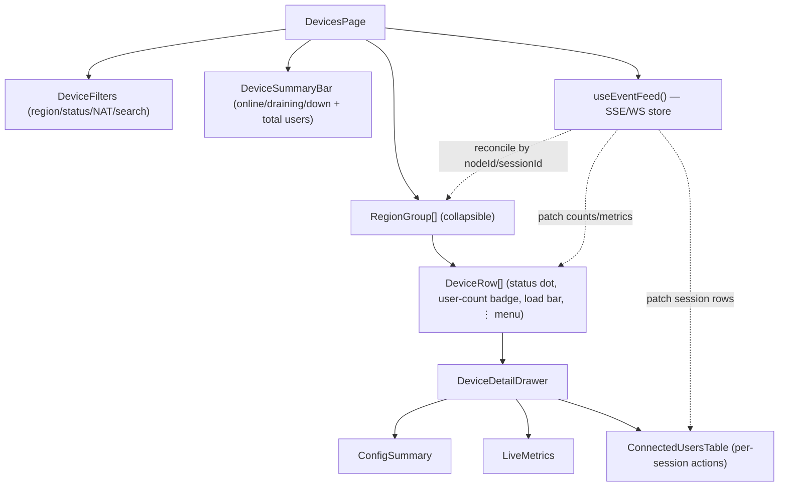

# Revquic Admin — Devices Page Wireframe

Detailed wireframe + interaction spec for the **Devices** page of the broker admin UI (see
[`../admin-web-ui.md`](../admin-web-ui.md)). The page shows all connected C exit nodes, grouped by
region, in **real time** — nodes appear/disappear and their parallel-user counts update live via the
`/events` feed (see [`../api/admin-openapi.yaml`](../api/admin-openapi.yaml)).

## 1. Layout (desktop)

```
┌───────────────────────────────────────────────────────────────────────────────────────┐
│ Revquic Admin            Overview   Users   [Devices]   Sessions            ● live   admin▾ │
├───────────────────────────────────────────────────────────────────────────────────────┤
│ Devices                                                                                   │
│ ┌─ filters ─────────────────────────────────────────────────────────────────────────┐  │
│ │ Region [All ▾]   Status [All ▾]   NAT [All ▾]   🔍 search nodeId / addr           │  │
│ └─────────────────────────────────────────────────────────────────────────────────────┘ │
│                                                                                           │
│ summary:  �● 12 online   ◐ 1 draining   ○ 2 down      users connected: 148               │
│                                                                                           │
│ ▼ us-west — 5 online · 63 users                                          [collapse ▲]    │
│ ┌──────┬────────────────┬────────┬───────────────┬──────┬──────────┬─────────┬────────┐ │
│ │ stat │ node           │ NAT    │ public addr   │ ver  │ users    │ load    │ actions│ │
│ ├──────┼────────────────┼────────┼───────────────┼──────┼──────────┼─────────┼────────┤ │
│ │  ●   │ exit-usw-01    │ p-rstr │ 203.0.113.10  │ 0.1  │ 18 / 50  │ ▓▓▓░ 36%│  ⋮     │ │
│ │  ●   │ exit-usw-02    │ cone   │ 203.0.113.11  │ 0.1  │ 27 / 50  │ ▓▓▓▓ 54%│  ⋮     │ │
│ │  ◐   │ exit-usw-03    │ symm   │ 203.0.113.12  │ 0.1  │  9 / 50  │ ▓▓░░ 18%│  ⋮     │ │
│ └──────┴────────────────┴────────┴───────────────┴──────┴──────────┴─────────┴────────┘ │
│                                                                                           │
│ ▼ eu-central — 4 online · 51 users                                       [collapse ▲]    │
│ ┌──────┬────────────────┬────────┬───────────────┬──────┬──────────┬─────────┬────────┐ │
│ │  ●   │ exit-euc-01    │ cone   │ 198.51.100.5  │ 0.1  │ 31 / 60  │ ▓▓▓░ 51%│  ⋮     │ │
│ │  ○   │ exit-euc-02    │  —     │ (last 198…7)  │ 0.1  │  0 / 60  │ ░░░░  — │  ⋮     │ │
│ └──────┴────────────────┴────────┴───────────────┴──────┴──────────┴─────────┴────────┘ │
│                                                                                           │
│ ▶ ap-south — 3 online · 34 users                                          [expand ▼]    │
└───────────────────────────────────────────────────────────────────────────────────────┘
```

Status glyphs: `●` online (green) · `◐` draining (amber) · `○` down (grey). The `● live` indicator in the
header reflects the `/events` connection state.

## 2. Node detail drawer (slides in on row click)

```
┌───────────────────────────── exit-usw-01 ─────────────────────────── [drain] [✕] ┐
│ ● online · us-west · since 2026-06-16 14:02:11Z (2h 49m)                          │
│                                                                                    │
│ Config                                  Live                                       │
│  region        us-west                   active users   18 / 50                    │
│  vpnType       quic-datagram             load           36%                        │
│  dataplaneMode both                      rtt to broker  24 ms                      │
│  uplinkIface   eth0                      last seen      1s ago                      │
│  version       0.1.0                     bytes (up/dn)  4.2G / 51.7G                │
│  NAT type      port-restricted                                                      │
│  public addr   203.0.113.10:4242                                                    │
│                                                                                    │
│ Connected users (18)                                  🔍 filter   [disconnect all] │
│ ┌────────────────┬──────────┬────────┬──────────┬───────────────┬───────────────┐ │
│ │ user           │ mode     │ state  │ since    │ up / down     │ actions       │ │
│ ├────────────────┼──────────┼────────┼──────────┼───────────────┼───────────────┤ │
│ │ alice          │ direct   │ active │ 41m      │ 120M / 1.8G   │ [disconnect]  │ │
│ │ bob            │ relay    │ relay  │ 12m      │  8M / 240M    │ [disconnect]  │ │
│ │ …                                                                              │ │
│ └────────────────┴──────────┴────────┴──────────┴───────────────┴───────────────┘ │
└────────────────────────────────────────────────────────────────────────────────────┘
```

Row "⋮" menu actions: **View detail**, **Drain** (`POST /nodes/{id}/drain`), **Undrain**, **Copy nodeId**.

## 3. Component hierarchy



## 4. Real-time data flow (client side)

1. On mount, `useEventFeed()` opens `GET /api/v1/events` (SSE) with the admin Bearer token.
2. First message is `Snapshot{nodes[], sessions[]}` → seed a normalized store keyed by `nodeId` and
   `sessionId`; render region groups.
3. Apply deltas to the store; Vue reactivity re-renders only affected rows:

| Event | Store mutation | Visible effect |
|---|---|---|
| `NodeConnected` | upsert node (status=online) | row **appears** in its region group; group counts +1 |
| `NodeUpdated` | patch load/rtt/health/activeUsers | load bar + user badge update in place |
| `NodeDisconnected` | set node status=down (keep briefly, then fade) or remove | dot → grey `○`; region "online" count −1 |
| `SessionStarted` | add session; node.activeUsers +1 | user-count badge +1; drawer table adds a row |
| `SessionEnded` | remove session; node.activeUsers −1 | badge −1; drawer row removed |

4. **Resilience:** on feed disconnect, header `● live` → grey, show a "reconnecting…" toast, exponential
   backoff reconnect; on reconnect, request a fresh `Snapshot` and **replace** the store (avoids drift).
5. **Derived counts** (per-region online/users, summary bar) are computed selectors over the store — never
   sent separately, so they can't disagree with the rows.

## 5. States & edge cases
- **Empty region:** show the group header with "0 online" and a muted "no devices connected" row.
- **No nodes at all:** full-page empty state with guidance ("Start a `revquic-exit` agent pointed at this
  broker").
- **Down node with history:** keep the row greyed for a short linger window showing `last seen` so an
  operator notices a flap, then drop it (configurable).
- **Draining node:** amber dot, user badge still live (existing sessions drain), "Undrain" offered.
- **Stale metrics:** if `lastSeen` exceeds the heartbeat-miss threshold but no `NodeDisconnected` yet,
  show the dot pulsing amber ("stale").
- **Permission:** read-only admins see the page but action buttons (drain/disconnect) are hidden/disabled.

## 6. Accessibility & responsive notes
- Status is conveyed by **glyph + text label + color** (not color alone) for colorblind accessibility.
- Each live region is an ARIA live region (`aria-live="polite"`) so screen readers announce node
  connect/disconnect.
- Load bars have text percentages; user counts are plain text (`18 / 50`).
- On narrow viewports, the table collapses to stacked cards (status, node, users badge, load, ⋮).

## 7. Data binding reference
| UI element | Source (OpenAPI) |
|---|---|
| Row status dot | `DeviceView.status` |
| NAT column | `DeviceView.natType` |
| public addr | `DeviceView.publicAddr` |
| users badge `n / cap` | `DeviceView.activeUsers` / `DeviceView.capacity` |
| load bar | `DeviceView.loadPct` |
| drawer config block | `DeviceView.config` (`DeviceConfigSummary`) |
| connected users table | `GET /nodes/{id}` → `sessions[]` (`Session`) + `SessionStarted/Ended` deltas |
| drain action | `POST /nodes/{id}/drain` |
| live updates | `GET /events` (`Event`) |
